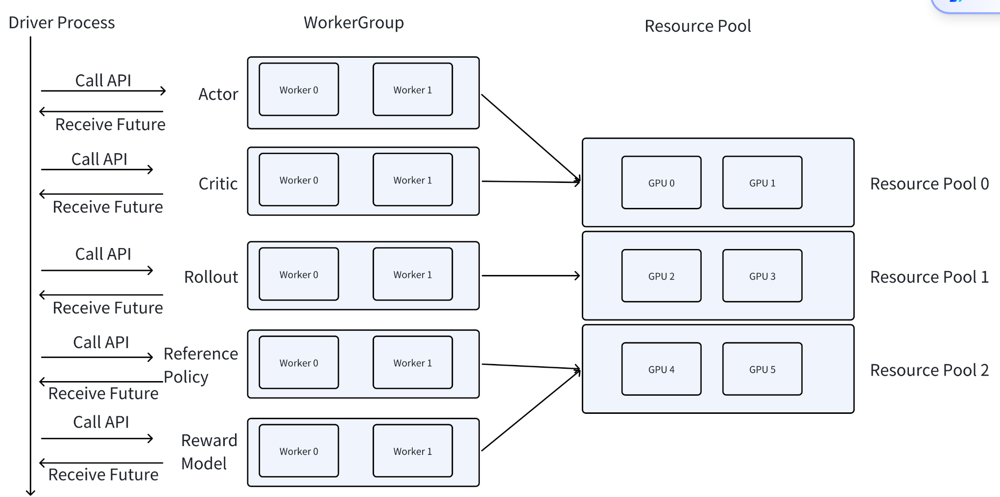

# TODO
1. actor与rollout似乎定义在不同的代码中, 具体调用如何对应到特定的worker或者说role
2. 异步式采样的实现, 以及异步式是否常用
3. 使用层面来看(reward, 整个rollout的框架)
# 概念
## 基础概念
1. Role
   逻辑上的分工, `actor`, `critic`, `reference`, `reward`四种. 
2. Worker/Ray Actor
   最小计算单元. 一个 Worker 通常在单张 GPU 上运行.
   我们所实现的`class`通过`ray.remote()`包装后再调用`.remote()`实例化后便会创建一个worker进程.
3. WorkerGroup
   同一类worker的集合, verl实际上调用的对象就是WorkerGroup, 而WorkerGroup在将指令分配到各个worker上来执行.
## 控制流与计算流
与深度学习不同, 强化学习涉及到多个网络协作.
- 控制流: 负责协调调度不同的上层组件(rollout, 优势计算)
- 计算流: 负责具体的网络内部前向传播与反向传播计算.
  
verl使用一个独立的进程来执行控制流, 多个进程执行计算流.


## 实现逻辑
verl的核心训练器为`RayPPOTrainer`, 各种强化学习算法都通过该训练器实现, 位于`verl\trainer\ppo\ray_trainer.py`, 其主要功能为:
- Worker 和 WorkerGroup 的构建
- 运行 PPO 算法的主循环

RayPPOTrainer 的 fit 函数**作为单个进程运行**, 对应上面提到的单独的控制流进程

每个 workerGroup 管理一个远程运行的工作节点列表. worker group 在其构造函数的进程中运行. WorkerGroup 中的每个 worker 运行在 GPU 上. worker group 作为控制器进程与一组工作节点交互的代理，以执行某些计算。为了做到这一点，我们必须将 worker 的方法绑定到 WorkerGroup 的方法，并定义数据分发和数据收集. 这通过简单的装饰器完成
在PPO中定义了4个worker:`ref_policy`, `actor_rollout`, `critic`, `reward`. 
> 如果使用lora的话, `ref_policy`会直接复用`actor_rollout`

下面将`actor_rollout`与`ref_policy`合并称为`ActorRolloutRef`
对于`ActorRolloutRefWorker`, 控制进程可以调用的api包括:
- init_model：构建底层模型
- generate_sequences：给定提示，生成响应
- compute_log_prob：使用 actor 计算生成序列的对数概率
- compute_ref_log_prob：使用 reference policy 计算生成序列的对数概率
- save_checkpoint：保存检查点

这些方法均定义在woreker中, 控制器进程必须通过远程调用来调用, 例如:
```python
for worker in actor_rollout_ref_wg:
    worker.init_model.remote()
```
若控制器进程想要调用worker group 方法通常可以分为 3 个部分：
- 将数据分割成数据并行大小
- 将相应的数据分发给每个 worker, 然后分别远程调用每一个worker对应的方法
- 计算完成后收集并连接数据
  
而实际上, verl通过装饰器封装了这三个步骤, 是的控制器进程可以直接调用worker group中对应的方法, 例如:
```python
@register(dispatch_mode=Dispatch.DP_COMPUTE_PROTO)
def generate_sequences(data):
    ...
# 在 driver 上
output = actor_rollout_ref_wg.generate_sequences(data)
```

# 代码执行流程
## 1. 训练入口`verl\trainer\main_ppo.py`
训练入口函数, 包括如下作用:
1. 初始化各种worker.
   1. 初始化`actor_rollout_worker`
   - 依据`config.actor_rollout_ref.actor.strategy`判断模型所采用**模型内部并行策略**(有fsdp与megatron两种选择), 分别调用`verl.workers.对应模型内部并行策略_workers`中的`ActorRolloutRefWorker`
   - 依据`config.actor_rollout_ref.rollout.mode`判断是否**异步**, 若异步则改为调用`AsyncActorRolloutRefWorker`
   - 将`role_worker_mapping[Role.ActorRollout]`映射到所创建的rollout worker.
   - 将`mapping[Role.ActorRollout]`映射到"global_pool"
   2. 初始化`critic_worker`
   3. 初始化`ref_policy_worker`
   判断是否使用KL散度, 若是
   - 将`role_worker_mapping[Role.RefPolicy]` = **同样映射到rollout worker**
   - 将`self.mapping[Role.RefPolicy]` 映射到 "global_pool"
2. 初始化`tokenlizer`与`processor`
3. 加载奖励函数
4. 创建数据集
   默认情况下dataset为`RLHFDataset`, 位于`verl\utils\dataset\rl_dataset.py`.
5. 初始化`RayPPOTrainer`
6. 调用`RayPPOTrainer..init_workers()`初始化workergroup, 绑定资源池
7. 调用`RayPPOTrainer.fit()`, 开始训练

## 2. dataset`verl\utils\dataset\rl_dataset.py`
dataset返回的 row_dict 包含的字段 ：
| 字段名 | 类型 | 来源 | 说明 |
| :--- | :--- | :--- | :--- |
| `input_ids` | `torch.Tensor` | processor/tokenizer | 文本 token ID 序列 |
| `attention_mask` | `torch.Tensor` | processor/tokenizer | 注意力掩码 |
| `position_ids` | `torch.Tensor` | 计算生成 | 位置 ID (MROPE 或普通) |
| `raw_prompt_ids` | `list[int]` | tokenizer.encode | 原始 prompt 的 token ID |
| `multi_modal_data` | `dict` | `qwen_vl_utils`从原始数据提取 | **原始**视觉数据 (图像/视频) |
| `multi_modal_inputs` | `dict` | processor 处理后 | **处理后**的视觉输入 (字典) |
| `index` | `int` | extra_info | 样本索引 |
| `tools_kwargs` | `dict` | extra_info | 工具调用参数 |
| `interaction_kwargs` | `dict` | extra_info | 交互参数 |
| `raw_prompt` | `list[dict]` | messages | 原始对话消息 (可选) |
| `full_prompts` | `str` | apply_chat_template | 带 template 的完整 prompt (可选) |
| `data_source` | `str` | 原始 parquet | 数据来源标识 |

实现流程:  
1. 数据预处理
   `examples\data_preprocess`
   拼接system prompt, 问题, 选项. 并将json**转换为Parquet格式**.
2. 读取数据集
   - 通过`_read_files_and_tokenize`函数读取数据集.
   传入数据集地址, 可以包含多个地址(list)
   数据集需要为`parquet`格式, 若有多个数据集会将其合并为1个
   - 若数据集数量超过限制, 对数据集的数量进行过滤
   - 调用`maybe_filter_out_long_prompts`, 过滤长度超过限制的数据.
3. 数据长度过滤
   `maybe_filter_out_long_prompts`
4. 构建message格式
   > video等视觉信息应该均包含在prompt的content中, 而不应该单独作为数据集的一项.
   通过下面代码检测其是否作为单独的一项.
   ```python
   self.image_key in example or self.video_key in example
   ```
   调用`_build_messages`, 该函数将prompt部分从数据中提取出来.
   而后将所有`content`沿视频或图片占位符进行分割为content列表.
   示例如下:
   ```python
   #处理前
   {
      "prompt": [
         {
               "role": "user",
               "content": "请描述这张图片 <image> 并解释视频 <video>"
         }
      ],
      "image": ["data:image/jpeg;base64,..."],
      "video": ["data:video/mp4;base64,..."]
   }

   #处理后
   {
      "prompt": [
         {
               "role": "user",
               "content": [
                  {"type": "text", "text": "请描述这张图片"},
                  {"type": "image", "image": "data:image/jpeg;base64,..."},
                  {"type": "text", "text": "并解释视频"},
                  {"type": "video", "video": "data:video/mp4;base64,..."}
               ]
         }
      ]
   }
   ```
5. 应用chat template
6. 处理视觉数据
   `verl\utils\dataset\vision_utils.py`
   对视觉信息的处理同样调用qwen-vl-utils来实现, 与oprn-r1-video无差.

    > 对于**未经process处理过的原始视觉数据**, 这里又重新将video, metadata两两打包, 同时将视频tensor转化为numpy. 作为最终返回的`row_dict`中的`multi_modal_data `
    > ```
    > multi_modal_data["video"] = [
    > (video.numpy(), metadata) for video, metadata in zip(videos, video_metadata, strict=True)]
    > ```
7. 调用`processor()`组和多模态数据
   > 对于**经过process处理过的视觉数据**会作为最终返回的`row_dict`中的`multi_modal_input`
   > 具体而言`multi_modal_input`中为processor处理后的`input`去掉`input_ids`, `attention_mask`, `second_per_grid_ts`, **是一个`dict`**
   > ```python
   > input_ids = model_inputs.pop("input_ids")
   > attention_mask = model_inputs.pop("attention_mask")
   > if "second_per_grid_ts" in model_inputs:
   >    model_inputs.pop("second_per_grid_ts")
   > ```
> 上面的操作与基于TRL实现的方法无异, 而下面的操作则为verl独有的
1. 统一长度(截断与填充)
   ```python
        input_ids, attention_mask = verl_F.postprocess_data(
            input_ids=input_ids,
            attention_mask=attention_mask,
            max_length=self.max_prompt_length,
            pad_token_id=self.tokenizer.pad_token_id,
            left_pad=True,
            truncation=self.truncation,
        )
    ```
2. 计算position_id
   - 适配qwen2-vl, qwen3-vl以及GLM4-v
   - 调用`verl/models/transformers/(对应模型)`中的`get_rope_index`
   - 返回`vision_position_ids`, 形状为(3, seq_lenth)
   - 拼接text_position_id与vision_position_ids并扩展一个维度->(4, seq_lenth)

## 3.训练器`RayPPOTrainer`
位置位于`verl\trainer\ppo\ray_trainer.py`
### 整体流程

### 数据集转换
首先, dataloader会调用`verl\utils\dataset\rl_dataset.py`中的`collate_fn`, dataset中的`__getitem__`返回的每个样本都是一个`dict`, 一个batch内的所有样本组成一个List.
dataset返回的单个样本数据例如:
```python
{
    # === 文本处理结果 ===
    "input_ids": torch.tensor([101, 7592, 2023, 6821, ...]),  # 文本 token ids
    "attention_mask": torch.tensor([1, 1, 1, 1, 1, ...]),     # attention mask
    "position_ids": torch.tensor([0, 1, 2, 3, 4, ...]),        # 位置 ids
    
    # === 原始视觉数据 ===
    "multi_modal_data": {
        "video": [
            # 视频帧数据 + 元数据
            (
                # numpy 数组: (num_frames, H, W, C)
                np.ndarray([
                    [[[255, 128, 64], ...], ...],  # frame 0
                    [[[200, 100, 50], ...], ...],  # frame 1
                    ...
                ]),
                # 视频元数据字典
                {
                    "num_frames": 32,
                    "fps": 30,
                    "duration": 1.067,
                    "height": 480,
                    "width": 854,
                }
            )
        ]
    },
    
    # === 处理后的多模态输入（用于模型）===
    "multi_modal_inputs": {
        # 视觉编码后的 tensor
        "pixel_values": torch.randn(1, 576, 1176),    # 图像特征
        "image_grid_thw": torch.tensor([[ 1, 24, 49]]),  # 图像 grid 形状 (MROPE)
        "video_grid_thw": torch.tensor([[32, 12, 17]]),  # 视频 grid 形状 (MROPE)
        # 注意: second_per_grid_ts 已被移除
    },
    
    # === 索引与元信息 ===
    "index": 42,
    "tools_kwargs": {"tool_use": False},
    "interaction_kwargs": {"max_turns": 3},
    
    # === 原始数据（来自 parquet）===
    "data_source": "video_dataset_001",
    
    # === 可选字段（取决于 config） ===
    # "raw_prompt": [...],        # return_raw_chat=True 时返回
    # "full_prompts": "...",      # return_full_prompt=True 时返回
}
```

`collate_fn`会将一个batch内多个样本组成的list中的相同的项进行合并, tensor仍然合并为tensor(增加一个维度), 而其余的合并为numpy数组(元素不一定为数字). 值得注意的是`"multi_modal_inputs"`虽然内部元素为tensor, 但它是一个dict, 所以`collate_fn`会将其转化为一个numpy数组.
`collate_fn`作用后的数据示例(batch_size = 4):
```python
batch_dict = {
    # === 文本特征 (Tensor, 自动堆叠) ===
    "input_ids": torch.tensor([
        [101, 7592, 2023, 6821, 1921, 102],      # sample 0
        [101, 220, 3362, 6712, 1912, 102],       # sample 1
        [101, 1184, 4278, 1234, 5678, 102],      # sample 2
        [101, 314, 4321, 9876, 5432, 102],       # sample 3
    ]),                                            # shape: (4, 6)
    
    "attention_mask": torch.tensor([
        [1, 1, 1, 1, 1, 1],    # sample 0
        [1, 1, 1, 1, 1, 1],    # sample 1
        [1, 1, 1, 1, 1, 0],    # sample 2 (padding)
        [1, 1, 1, 1, 1, 1],    # sample 3
    ]),                                              # shape: (4, 6)
    
    "position_ids": torch.tensor([
        [0, 1, 2, 3, 4, 5],    # sample 0
        [0, 1, 2, 3, 4, 5],    # sample 1
        [0, 1, 2, 3, 4, 5],    # sample 2
        [0, 1, 2, 3, 4, 5],    # sample 3
    ]),                                              # shape: (4, 6)
    
    # === 处理后的多模态输入 (dict → numpy object 数组) ===
    "multi_modal_inputs": np.array([
        {
            "pixel_values": torch.randn(1, 576, 1176),
            "image_grid_thw": torch.tensor([[1, 24, 49]]),
            "video_grid_thw": torch.tensor([[2, 12, 17]]),
        },    # sample 0
        {
            "pixel_values": torch.randn(1, 576, 1176),
            "image_grid_thw": torch.tensor([[1, 24, 49]]),
            "video_grid_thw": torch.tensor([[2, 12, 17]]),
        },    # sample 1
        {
            "pixel_values": torch.randn(1, 576, 1176),
            "image_grid_thw": torch.tensor([[0, 0, 0]]),  # 无图像
            "video_grid_thw": torch.tensor([[4, 8, 17]]),
        },    # sample 2 (无图像，只有视频)
        {
            "pixel_values": torch.randn(1, 576, 1176),
            "image_grid_thw": torch.tensor([[2, 24, 49]]),  # 2张图
            "video_grid_thw": torch.tensor([[0, 0, 0]]),
        },    # sample 3 (2张图，无视频)
    ], dtype=object),
    
    # === 原始视觉数据 (dict → numpy object 数组) ===
    "multi_modal_data": np.array([
        {
            "video": [
                (
                    np.ndarray(shape=(2, 480, 854, 3), dtype=np.uint8),
                    {"num_frames": 2, "fps": 30, "duration": 0.067, "height": 480, "width": 854}
                )
            ]
        },    # sample 0
        {
            "video": [
                (
                    np.ndarray(shape=(4, 480, 854, 3), dtype=np.uint8),
                    {"num_frames": 4, "fps": 30, "duration": 0.133, "height": 480, "width": 854}
                )
            ]
        },    # sample 1
        {
            "video": [
                (
                    np.ndarray(shape=(8, 480, 854, 3), dtype=np.uint8),
                    {"num_frames": 8, "fps": 30, "duration": 0.267, "height": 480, "width": 854}
                )
            ]
        },    # sample 2
        {
            "image": [
                (
                    np.ndarray(shape=(480, 854, 3), dtype=np.uint8),
                    {"height": 480, "width": 854}
                ),
                (
                    np.ndarray(shape=(480, 854, 3), dtype=np.uint8),
                    {"height": 480, "width": 854}
                ),
            ]
        },    # sample 3
    ], dtype=object),
    
    # === 索引与元信息 (非张量 → numpy object 数组) ===
    "index": np.array([42, 87, 123, 456], dtype=object),
    
    "tools_kwargs": np.array([
        {"tool_use": False, "max_steps": 100},      # sample 0
        {"tool_use": True, "max_steps": 200},       # sample 1
        {"tool_use": False, "max_steps": 150},      # sample 2
        {"tool_use": True, "max_steps": 100},       # sample 3
    ], dtype=object),
    
    "interaction_kwargs": np.array([
        {"max_turns": 3, "temperature": 0.7},       # sample 0
        {"max_turns": 5, "temperature": 0.8},       # sample 1
        {"max_turns": 3, "temperature": 0.7},       # sample 2
        {"max_turns": 2, "temperature": 0.9},       # sample 3
    ], dtype=object),
    
    "data_source": np.array([
        "video_dataset_001",    # sample 0
        "video_dataset_001",    # sample 1
        "video_dataset_002",    # sample 2
        "image_dataset_001",    # sample 3
    ], dtype=object),
}
```

最后对于`dataloader`所返回的`row_dict`进行进一步处理, **转换为`DataProto`格式**
总的而言就是将tensou和numpy数组分开, 分别放入`batch`与`non_tensor_batch`两项中.
此外还会给每个样本生成一个uid, 放入`non_tensor_batch["uid"]`中.
```python
# DataProto 结构
data_proto = DataProto(
    # === batch: TensorDict (存储所有张量) ===
    batch=TensorDict({
        "input_ids": torch.tensor([
            [101, 7592, 2023, 6821, 1921, 102],
            [101, 220, 3362, 6712, 1912, 102],
            [101, 1184, 4278, 1234, 5678, 102],
            [101, 314, 4321, 9876, 5432, 102],
        ]),  # shape: (4, 6)
        
        "attention_mask": torch.tensor([
            [1, 1, 1, 1, 1, 1],
            [1, 1, 1, 1, 1, 1],
            [1, 1, 1, 1, 1, 0],
            [1, 1, 1, 1, 1, 1],
        ]),  # shape: (4, 6)
        
        "position_ids": torch.tensor([
            [0, 1, 2, 3, 4, 5],
            [0, 1, 2, 3, 4, 5],
            [0, 1, 2, 3, 4, 5],
            [0, 1, 2, 3, 4, 5],
        ]),  # shape: (4, 6)
    }, batch_size=4),
    
    # === non_tensor_batch: dict (存储所有非张量) ===
    non_tensor_batch={
        # 多模态数据
        "multi_modal_inputs": np.array([
            {
                "pixel_values": torch.randn(1, 576, 1176),
                "image_grid_thw": torch.tensor([[1, 24, 49]]),
                "video_grid_thw": torch.tensor([[2, 12, 17]]),
            },
            {
                "pixel_values": torch.randn(1, 576, 1176),
                "image_grid_thw": torch.tensor([[1, 24, 49]]),
                "video_grid_thw": torch.tensor([[2, 12, 17]]),
            },
            {
                "pixel_values": torch.randn(1, 576, 1176),
                "image_grid_thw": torch.tensor([[0, 0, 0]]),
                "video_grid_thw": torch.tensor([[4, 8, 17]]),
            },
            {
                "pixel_values": torch.randn(1, 576, 1176),
                "image_grid_thw": torch.tensor([[2, 24, 49]]),
                "video_grid_thw": torch.tensor([[0, 0, 0]]),
            },
        ], dtype=object),
        
        "multi_modal_data": np.array([
            {
                "video": [
                    (
                        np.ndarray(shape=(2, 480, 854, 3), dtype=np.uint8),
                        {"num_frames": 2, "fps": 30, "duration": 0.067, "height": 480, "width": 854}
                    )
                ]
            },
            {
                "video": [
                    (
                        np.ndarray(shape=(4, 480, 854, 3), dtype=np.uint8),
                        {"num_frames": 4, "fps": 30, "duration": 0.133, "height": 480, "width": 854}
                    )
                ]
            },
            {
                "video": [
                    (
                        np.ndarray(shape=(8, 480, 854, 3), dtype=np.uint8),
                        {"num_frames": 8, "fps": 30, "duration": 0.267, "height": 480, "width": 854}
                    )
                ]
            },
            {
                "image": [
                    (
                        np.ndarray(shape=(480, 854, 3), dtype=np.uint8),
                        {"height": 480, "width": 854}
                    ),
                    (
                        np.ndarray(shape=(480, 854, 3), dtype=np.uint8),
                        {"height": 480, "width": 854}
                    ),
                ]
            },
        ], dtype=object),
        
        # 索引与元信息
        "index": np.array([42, 87, 123, 456], dtype=object),
        
        "tools_kwargs": np.array([
            {"tool_use": False, "max_steps": 100},
            {"tool_use": True, "max_steps": 200},
            {"tool_use": False, "max_steps": 150},
            {"tool_use": True, "max_steps": 100},
        ], dtype=object),
        
        "interaction_kwargs": np.array([
            {"max_turns": 3, "temperature": 0.7},
            {"max_turns": 5, "temperature": 0.8},
            {"max_turns": 3, "temperature": 0.7},
            {"max_turns": 2, "temperature": 0.9},
        ], dtype=object),
        
        "data_source": np.array([
            "video_dataset_001",
            "video_dataset_001",
            "video_dataset_002",
            "image_dataset_001",
        ], dtype=object),
    },
    
    # === meta_info: dict (存储额外元信息) ===
    meta_info={
        # 可选: 用于自动填充等场景
        # "_verl_auto_padding": False,
    }
)
```

### 采样生成
#### 1. 采样所需输入数据构建
首先调用`self._get_gen_batch(batch)`生成用于采样的`DataProto`数据`gen_batch`, 该方法会将原始的数据`batch`中采样生成所需要的元素转移到`gen_batch`中, 剩余的保留在`batch`中.

具体而言, 对于`batch.non_tensor_batch`需要将`{"data_source", "reward_model", "extra_info", "uid"}`保留在batch中, 剩余的全部移到`gen_batch.non_tensor_batch`中; 而对于`batch.batch`, 需要将`"input_ids", "attention_mask", "position_ids"`移到`gen_batch`中.

处理后的`batch`与`gen_batch`中的元素情况为:
| 键名 | 原始位置 | pop后原batch中 | gen_batch中 |
| :--- | :--- | :--- | :--- |
| `input_ids` | batch.batch | ❌ 无 | ✅ 有 |
| `attention_mask` | batch.batch | ❌ 无 | ✅ 有 |
| `position_ids` | batch.batch | ❌ 无 | ✅ 有 |
| `data_source` | non_tensor_batch | ✅ 有 | ❌ 无 |
| `uid` | non_tensor_batch | ✅ 有 | ❌ 无 |
| `reward_model` | non_tensor_batch | ✅ 有 | ❌ 无 |
| `extra_info` | non_tensor_batch | ✅ 有 | ❌ 无 |
| `multi_modal_data` | non_tensor_batch | ❌ 无 | ✅ 有 |
| `multi_modal_inputs` | non_tensor_batch | ❌ 无 | ✅ 有 |
| `index` | non_tensor_batch | ❌ 无 | ✅ 有 |

#### 2. 采样生成以及合并结果
首先调用`gen_batch.repeat`, 将`gen_batch`中的所有key对应的值复制rollout次, 这里采用interleave, 及对每个元素单独复制而非作为整体, 最终得到`gen_batch_output`

将`gen_batch_output`送入采样函数进行采样, 返回`gen_batch_output`
```python
gen_batch_output = self.actor_rollout_wg.generate_sequences(gen_batch_output)
```
`gen_batch_output`中包含如下信息:
```
DataProto
├── batch: TensorDict (batch_size = 原始batch_size × repeat_times)
│   ├── input_ids:        Tensor[bs, prompt_length]   原始prompt tokens
│   ├── responses:        Tensor[bs, response_length] 生成的response tokens
│   ├── sequences:        Tensor[bs, prompt+response] 完整序列
│   ├── old_log_probs:    Tensor[bs, response_length] 响应token的log概率
│   ├── attention_mask:   Tensor[bs, prompt+response] 完整序列的attention mask
│   └── position_ids:     Tensor[bs, prompt+response] 完整序列的位置ID
│
├── non_tensor_batch:     空字典 (在naive rollout中)
│
└── meta_info:            原始的meta_info (EOS token等信息)
```
而后调用`batch.repeat`将`batch`中的所有key对应的值复制rollout次与`gen_batch_output`合并.
复制后的`batch`结构为:
```
重复后的 batch (batch_size = 4 × n = 12, 假设 n=3):
├── batch: TensorDict (batch_size = 12)
│   ├── input_ids:        Tensor[12, prompt_len]     交错重复: [P0,P0,P0, P1,P1,P1, P2,P2,P2, P3,P3,P3]
│   ├── attention_mask:   Tensor[12, prompt_len]     同上
│   ├── position_ids:     Tensor[12, prompt_len]     同上
│   └── (其他张量键...)
│
├── non_tensor_batch: dict (batch_size = 12)
│   ├── data_source:      ['ds1','ds1','ds1', 'ds2','ds2','ds2', 'ds3','ds3','ds3', 'ds4','ds4','ds4']
│   ├── reward_model:     ['rm1','rm1','rm1', 'rm2','rm2','rm2', ...]
│   ├── extra_info:       ['info1','info1','info1', ...]
│   ├── uid:              [101,101,101, 102,102,102, 103,103,103, 104,104,104]
│   ├── multi_modal_data: {...}     每个样本重复3次
│   └── multi_modal_inputs: {...}   每个样本重复3次
│
└── meta_info: dict (不变)
    └── eos_token_id:     [128009, ...]
```
合并后的`batch`结构为:
```
最终 batch (batch_size = 4 × n = 12):
├── batch: TensorDict (batch_size = 12)
│   ├── input_ids:        Tensor[12, prompt_len]       来自 gen_batch_output (覆盖)
│   ├── attention_mask:   Tensor[12, prompt+resp]      来自 gen_batch_output (更新)
│   ├── position_ids:     Tensor[12, prompt+resp]      来自 gen_batch_output (更新)
│   ├── responses:        Tensor[12, resp_len]         来自 gen_batch_output (新增)
│   ├── sequences:        Tensor[12, prompt+resp]      来自 gen_batch_output (新增)
│   └── old_log_probs:    Tensor[12, resp_len]         来自 gen_batch_output (新增)
│
├── non_tensor_batch: dict (batch_size = 12)
│   ├── data_source:      ['ds1','ds1','ds1', ...]     保留自原始batch
│   ├── reward_model:     ['rm1','rm1','rm1', ...]     保留自原始batch
│   ├── extra_info:       ['info1','info1','info1', ...] 保留自原始batch
│   ├── uid:              [101,101,101, 102,102,102, ...] 保留自原始batch
│   ├── multi_modal_data: {...}                        保留自原始batch
│   └── multi_modal_inputs: {...}                      保留自原始batch
│
└── meta_info: dict
    └── eos_token_id:     [128009, ...]                保留自原始batch
```

### 奖励与优势计算
#### 1. 奖励计算
判断是否使用奖励模型, 以及是否异步计算奖励, 分别调用对应的`compute_reward`计算奖励得到`reward_tensor`, 而后合并到batch中.
> 对于异步奖励计算有待进一步了解

#### 2. 计算`old_log_prob`
这里的`old_log_prob`即在每一个batch更新参数前调用**当前的训练策略**计算得到的`log_prob`. 具体而言在`RayPPOTrainer`中调用`self.actor_rollout_wg.compute_log_prob(batch)`.
> 代码中对于`log_prob`的计算除了上面的直接调用对应`workergroup`的`compute_log_prob`外, 在`self.use_legacy_worker_impl == "disable"`时还有一种实现, 有待进一步了解. 位于`RayPPOTrainer`中的`_compute_old_log_prob`方法.

这里verl实现了两种模式: Bypass mode与Decoupled mode. 在Bypass mode模式下涉及两个策略: π_rollout, π_θ; 而在Decoupled mode下涉及三个策略: π_rollout, π_old, π_θ. 
只有在Decoupled mode会依据上面的所说的过程计算得到`old_log_prob`, **在Bypass model下`old_log_prob`会直接被赋值为`rollout_log_prob`(采样时计算得到)**
> Bypass model应用于采样训练同步模式下, 而Decoupled model应用于异步情况下.
> Decoupled model以及异步情况有待进一步了解.

#### 3. 计算`ref_log_prob`
这里的`ref_log_prob`指参考策略的`log_prob`, 用于计算KL散度.
```python
if self.use_reference_policy:
    ref_log_prob = self._compute_ref_log_prob(batch)
    batch = batch.union(ref_log_prob)
```
#### 4. 在奖励中添加KL散度
若异步计算奖励, 则通过`ray.get(future_reward)`调取奖励结果; 若同步则直接将reward_tensor记录到batch中
> 这里的异步计算奖励以及对应的同步机制有待进一步了解.

如果`self.config.algorithm.use_kl_in_reward`在在奖励中添加KL散度, 则调用`apply_kl_penalty`, **该函数使用前面的**`old_log_prob`**以及**`ref_log_prob`**计算KL散度**
> 这里对于KL散度的估计方式有待进一步了解

> 如果在奖励中添加KL散度, `old_log_prob`在一个batch内是不会更新的, 但一个batch内参数可以更新多次, 这是否会带来问题???
>
#### 5. 计算优势
调用`compute_advantage`函数计算优势

#### 6. 更新critic
略

### loss计算与更新参数
调用链:
`_update_actor` -> `self.actor_rollout_wg.update_actor(batch)` -> `verl\workers\actor\dp_actor.py`中的`DataParallelPPOActor.update_policy`
> 对workergroup的调用如何对应到具体的worker的方法上的? 有待了解

#### 1. 数据处理
首先从原始的数据中提取所需要的key
#### 2. loss计算
 然后调用对应的loss函数计算loss.
> 这里对于on-policy模式(当mini_batch与ppo_epochs(同一个batch训练几次)均为1),用新计算的log_probs替代在一个batch开始前计算得到的old_log_prob. 具体原因有待进一步了解.
#### 3. 矫正rollout
在异步模式(非bypass)下矫正rollout
> 对于异步模式下的rollout矫正有待进一步了解
#### 4. KL in loss
如果在loss中应用KL散度, 调用
```python
kl_penalty(logprob=log_prob, ref_logprob=ref_log_prob, kl_penalty=self.config.kl_loss_type)
```
计算KL散度, 使用当前策略计算出的`log_prob`以及`ref_log_prob` ,`kl_penalty`参数决定KL散度的估计类型.
而后调用`agg_loss`聚合计算得到的Kl散度为一个单一的损失值后将其合并到loss当中.

#### 5. 梯度缩放/反向传播/参数更新
略


# Ray分布式
详细官方教程可见:`examples\ray\tutorial.ipynb`
相关blog可以参考:[verl框架：1. Ray 集群介绍 + verl 中基于 Ray 的执行流程解析](https://lywencoding.com/posts/5d9f220e.html)

## ray基础操作, 流程以及api
### 基础 api
1. 我们可以通过装饰器`@ray.remote`或者直接调用`ray.remote()`将一个`class`转化为一个`remoet class`.
2. 然后通过`remote_class.remote()`对其进行实例化为一个`ray actor`
3. 调用实例的方法时, 需要加上 `remote()`, 即`对象实例.函数名.remote()`
4. 当需要结果时, 通过`ray.get()`获取结果
   
值得注意的是:
- 使用 Ray 时：异步执行, **func_name.remote非阻塞**；**ray.get(ObjectRef)阻塞**
- 方法调用会立即返回一个 ray.ObjectRef，调用者不需要等待这个函数的计算真正执行完，函数的计算是在后台某个计算节点上执行的
- ray.get(ObjectRef) 会等待后台计算结果执行完，将结果返回给调用者.
  
代码示例:
```python
@ray.remote
class Counter:
    def __init__(self):
        self.value = 0

    def increment(self):
        self.value += 1
        return self.value

    def get_counter(self):
        return self.value

counter = Counter.remote()

obj_ref = counter.increment.remote()
print(ray.get(obj_ref))
```
### 资源池
1. 首先将通过`ray.remote()`装饰的`remote class`通过`RayClassWithInitArgs`与其的初始化参数包装在一起.
2. 然后将资源池与`RayClassWithInitArgs`包装为`RayWorkerGroup`
3. 对`worker_group`调用worker中对应的方法
代码示例:
```python
resource_pool = RayResourcePool([4], use_gpu=True)

@ray.remote
class GPUAccumulator(Worker):
    def __init__(self) -> None:
        super().__init__()
        # The initial value of each rank is the same as the rank
        self.value = torch.zeros(size=(1,), device="cuda") + self.rank

    def add(self, x):
        self.value += x
        print(f"rank {self.rank}, value: {self.value}")
        return self.value.cpu()

# Each worker's initial value is its rank, and then each rank's value is incremented by 1, so the values obtained on each rank are [1, 2, 3, 4]
class_with_args = RayClassWithInitArgs(cls=GPUAccumulator)
worker_group = RayWorkerGroup(resource_pool, class_with_args)
print(worker_group.execute_all_sync("add", x=[1, 1, 1, 1]))
```
## verl中的ray
### 训练入口`TaskRunner`
`verl\trainer\main_ppo.py`
#### 1. 创建资源池->role的映射
位于`TaskRunner`的`mappping`属性

这里的**资源池还是标志ID, 并未实际进行创建**
默认情况下, 所有`worker`均使用`global_pool`, 如果`config.reward_model.enable_resource_pool`为True, reward worker可以使用单独的`reward_pool`
#### 2. 创建`ResourcePoolManager`
位于`TaskRunner`的`init_resource_pool_mgr`方法

创建`resource_pool_spec`, 为一个字典, key为资源池的标志id, value为对应的设备数(依据配置文件`[config.trainer.n_gpus_per_node] * config.trainer.nnodes`), 例如:
```python
# 示例：如果 nnodes=2, n_gpus_per_node=4
resource_pool_spec = {
    "global_pool": [4, 4]  # 2个节点，每个节点4个GPU，共8个GPU
}
```

实例化`ResourcePoolManager(resource_pool_spec=resource_pool_spec, mapping=self.mapping)`

### 训练器`RayPPOTrainer`
`verl\trainer\ppo\ray_trainer.py`
`TaskRunner`实例化`RayPPOTrainer`后, 会先调用`RayPPOTrainer`的`init_worker`方法

代码流程:
1. 创建资源池
   ```python
   self.resource_pool_manager.create_resource_pool()
   ```
2. 包装worker对应的`remote class`与初始化参数为`RayClassWithInitArgs`
3. 创建资源池到的`RayClassWithInitArgs`映射字典`resource_pool_to_cls`
    resource_pool_to_cls是一个双层嵌套字典
    外层key：resource_pool对象（RayResourcePool实例）
    外层value：该资源池对应的角色→类的映射
    外层value示例：
    ```python
    {
        "actor_rollout_ref": RayClassWithInitArgs(cls=ActorRolloutRefWorker,config=..., role="actor_rollout_ref"),
        "critic": RayClassWithInitArgs(cls=CriticWorker, config=...),
     }
    ```
     内层key：角色字符串（如"actor_rollout_ref"）
     内层value：RayClassWithInitArgs实例
4. 设置workergropu的kwargs
5. 将同一资源池下的worker合并并拆分workergroup
   可以参考blog:[VeRL中colocate实现源码解析](https://zhuanlan.zhihu.com/p/31595392436)
   对于`resource_pool_to_cls`下的每一个资源池对应的value, 调用`create_colocated_worker_cls`, 这会返回一个`worker_dict_cls`, 是合并后的`RayClassWithInitArgs`

    通过`RayWorkerGroup`将前面创建的`worker_dict_cls`与对应的资源池包装为workergroup, 得到`wg_dict`

    随后调用`wg_dict`的`spawn`方法, 这会将不同的role分开为不同的workergroup, 使得其可以分开进行调用, 但值得注意的是, **这并不会创建新的worker进程, 调用的还是原来的`wg_dict`中的worker的方法**, 这么做仅是为了便于调用.
    也就是说**分开后的不同role对应的workergroup他们所管理的还是原来合并好的`worker_dict_cls`对应的worker**
6. 初始化模型
   调用不同workergroup的`init_model()`方法, 主要有如下作用
    - 加载模型权重
    - 配置优化器
    - 设置分布式训练 (如果启用)
    - 移动模型到 GPU

# 使用参数设置

