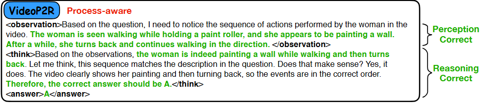
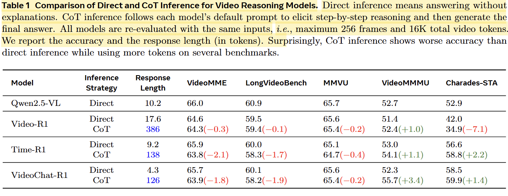
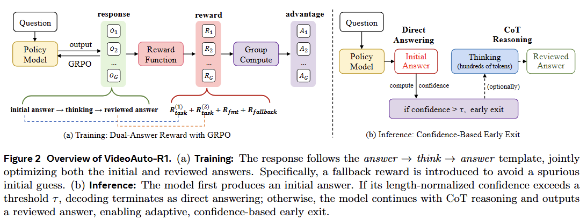
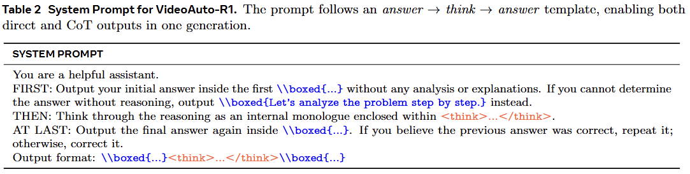
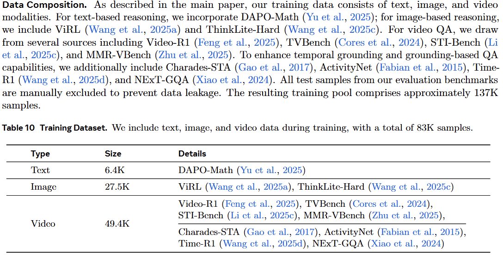
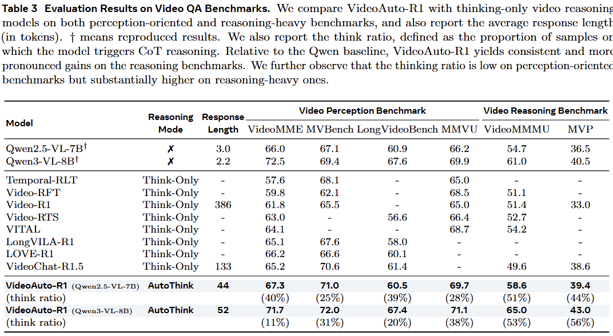
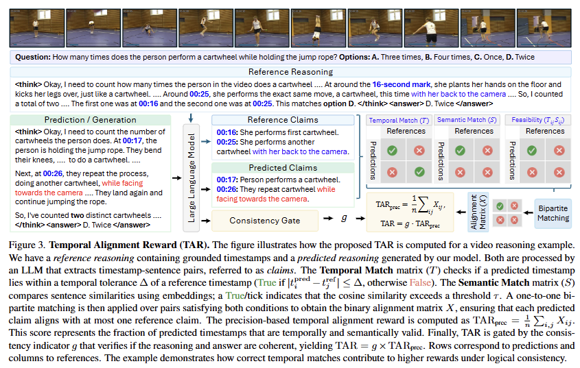
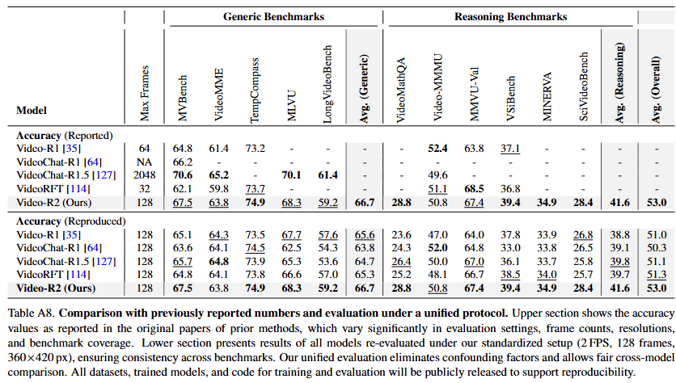

# 提高视觉感知
## VIDEOP2R: Video Understanding from Perception to Reasoning(2025/11/14)
[alphaxiv](https://www.alphaxiv.org/abs/2511.11113?chatId=019b83d1-99e3-7e8c-8bf6-3ba404e3a661)
### 动机
本文认为, 直接对视频推理进行GRPO微调, 以最终结果确定奖励忽略了视觉问题的两个步骤: 感知与推理.
而本文的解决方案也很简单, 推理之前增加一段描述视频内容, 将感知与推理分开.

### 奖励
在格式与最终答案的基础上新增了一个感知奖励, 通过一个LLM衡量感知部分的表述能否得到最终的答案.
问题+感知描述+答案 -(LLM)-> 感知奖励
### 数据
162K SFT + 162K RL. 数据量有点夸张. 

# 推理流程
## VideoAuto-R1: Video Auto Reasoning via Thinking Once, Answering Twice
[alphaxiv](https://www.alphaxiv.org/abs/2601.05175?chatId=019c137f-cbcf-70d8-874c-62163dc5e064)

### motivation
本文认为, 对于视频理解任务而言, 由于其信息密度较低, 包含大量的无关信息, 感知通常情况下比逐步进行推理更为重要, 且实现准确的感知后的推理较为简单, 因此思维链不能很好地发挥作用, 并不是所有问题都需要一个思维链.

从实验结果也可以看出, 对于现有的强化过推理训练的model而言, 只有在videommmu上使用思维链回去的稳定的提升. 而且作者发现**cot正确但直接回答错误的样本往往是数学或者物理相关的. 也就是说对于普通的视频内容cot(纯文字)不能很好地发挥作用.**

### method

通过prompt是模型以answer thinking answer的形式输出. 值得注意的是第一个答案可以输出"let's analyze the problem step by step", 这意味着如果模型难以给出答案不必要非得猜一个.

奖励包括四部分: 两个答案的准确性奖励, 格式奖励以及fallback奖励(当模型在第一个答案输出"let's analyze the problem step by step"且推理后回答正确)

值得注意的是, 在训练过程中无论模型确定与否都输出这个流程, **在推理过程中通过输出第一个答案时的信息熵决定是否继续后续的步骤.** videochat-r1.5也是这种模式, **看来在训练时尽量使用固定的推理流程也许是更好的选择**
>作者认为这种了流程比直接教给模型自己能决定选择不同的推理模式需要的数据量更少, 训练也更为稳定.

### experiment

除了视频数据, 文章还使用了文本与图像的推理数据. **文章是基于instruct模型继续训练的**, 如果基于thinking模型也许便不再必要, 而本文之所以从Instruct开始推测是为了更好的使模型适应这种推理范式.

本文共用了80k+数据, 数据量很大, 32卡H100训练35h, 从thinking开始应该不需要这样的数据量.
### result

方法的结果较为较好, 无论是通用的视频benchmark还是推理类的

## Video-R2
[alphaxriv](https://www.alphaxiv.org/abs/2511.23478)
### 现有问题
对视觉的关注度薄弱. 推理结果与最终输出的结果不一致.
### 解决方案
通过prompt以及SFT, 使得模型的**推理过程中不仅包含纯文本描述, 还包含temporal grounding**. 

然后在通过GRPO训练. 具体来说通过一个轻量LLM(Gpt-4o-mini)来提取推理过程中的grounding以及对应的事件描述, 再和ground truth进行对比(grounding的偏差是否超过阈值, 对时间的描述embedding后计算余弦相似度). 

总的来说, 这种方法在强化推理过程中对视频的关注的同时还引入了GRPO训练的推理过程奖励. 此外为了解决推理结果与最终输出的结果不一致的问题, 还引入了**一致性作为获得奖励的必要条件**:
 
一致性通过LLM提取推理过程中的答案(Qwen3-Next-80B-A3B).
### 数据集
#### 数据集概览
总样本量： 15,271 个样本。
涉及视频数： 11,816 个唯一视频。
核心特征： 每个样本都包含由 Gemini-2.5-Pro 生成的、经过逻辑一致性过滤的“参考推理轨迹（Reference Reasoning Traces）”，这些轨迹明确引用了视频中的具体时间点。
#### 数据来源 (Data Sources)
LLaVA-Video-178K
NeXtQA（侧重因果推理）
ActivityNet-QA（侧重人类活动）
PerceptionTest（侧重感知能力）
Clevrer（侧重物理与逻辑推理）
#### 构建流程 (Construction Pipeline)
作者通过一套严格的流程，从约 20 万原始数据中筛选出了最核心的 1.5 万条：
1. 难度分级 (Difficulty Ranking)
为了让模型学会真正的深层推理，而不是回答简单问题，作者使用 LLM 对问题进行打分（0-10分）。
筛选标准： 只保留**最难的（Top 15K）**样本。
2. 推理重生成 (Reasoning Regeneration)
这是数据集的核心价值所在。原始数据集通常只有答案没有推理过程，或者推理过程质量不高。作者使用目前最强的多模态模型之一 Gemini-2.5-pro，在给定正确答案的前提下，生成带有时间戳的详细推理步骤。
3. 质量过滤 (Filtering)
为了防止 Gemini 产生幻觉，作者实施了双重过滤：
自动化过滤： 计算 TAC 指标，如果 Gemini 生成的推理结论和给定的正确答案不一致（TAC=0），直接丢弃。
人工抽检： 随机抽取 500 条进行人工验证，确保无事实错误。
#### 训练集划分 (Data Split)
作者根据难度评分，将这 1.5 万条数据划分为两部分，分别用于两个训练阶段：
Top 30% 最难的样本（4,804条）： 用于 GRPO（强化学习） 阶段。
剩余 70% 的样本（10,467条）： 用于 SFT（有监督微调） 阶段。
数据集的时间戳既包含时间点的形式也包含时间段的形式
### 实验

### 思考
**总的来看这篇工作还是偏向于数据与奖励, 设计更为准确的奖励函数, 构造更为优质的数据**

这篇文章将temporal grounding放入推理过程, 这种做法的必要性有待验证, 这会给检查结果带来额外的困难, 需要使用额外的LLM来提取答案.

从结果来看提升也比较有限, 但文章的工作量却很大, 构造数据还是推理过程监督的RL训练, 感觉方向不太对.

引入了很多的过程监督, 这就意味着需要引入大模型来做judge.
Temporal grounding不应该限制到一段.
数据集也许可以用到.

