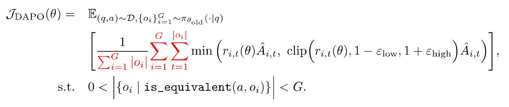
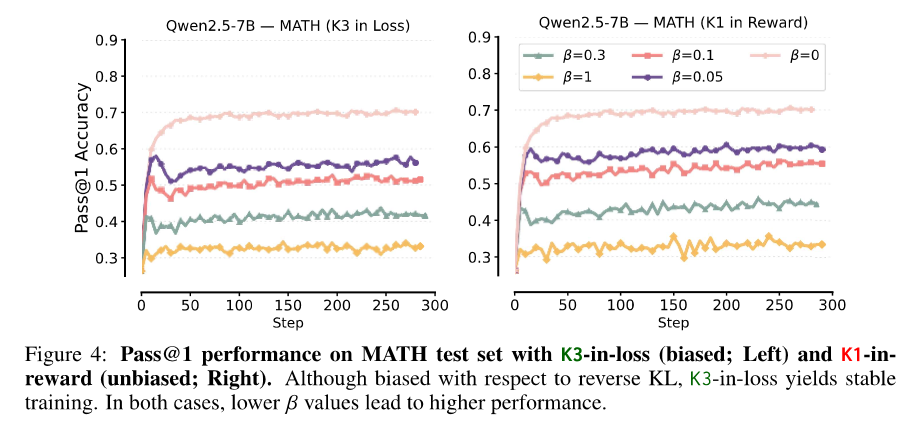
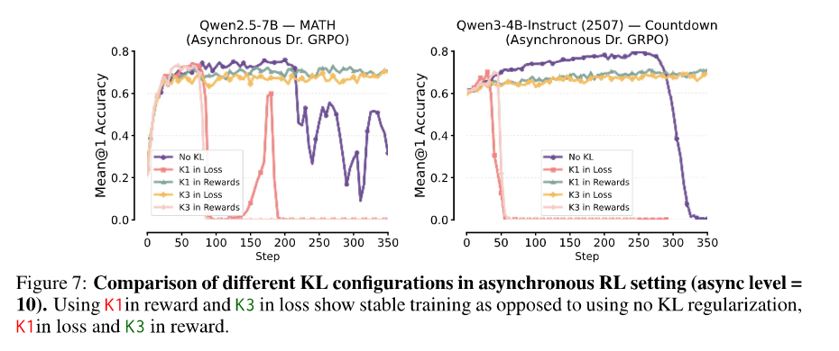

# paper
## DAPO

对GRPO做了五个细节上的改动.
1. 提高clip的上界.
原始的GRPO中模型会很快变得预测token时的信息熵很小, 这会使得采样趋向于统一, 抑制模型的探索.
作者提出通过增加clip的上界能够使得那些本来概率较小的token更好的被探索到.
> batch仅更新一次clip无效的问题?
2. 动态数据采样
   仅保留group中有对有错的数据样本.
3. 去除generstion级别的平均.
   这会导致较长的generation的token贡献减弱, 产生不必要的bias
4. 过长generation丢弃+软惩罚
5. 去掉KL散度约束
   作者认为对于长CoT推理模型和base模型的变化较大.
> 泛化性问题?灾难性遗忘?

## Stabilizing Reinforcement Learning with LLMs: Formulation and Practices(2025/12)
从理论以及实验上总结了并验证了如何让强化学习更稳定, 重点从**目标上的sequence-level**以及**实际优化上的token-level**的差异入手, 同时重点关注MoE模型.
### 理论分析
#### sequence-level奖励难以直接优化
由于奖励是sequence-level奖励, 而目标是让奖励最大, 所以RL的优化目标也是sequence-level的.

> 这里的重要性采样的概率也是整个序列的概率(相当于每个token的概率相乘)
> 文章将重要性采样的概率差异分为两部分: train engine与inference engine不同, 策略不同(多轮更新)

而在实际中, 我们进行的优化都是token级别的

核心差异就在于**重要性采样由原来的求积变为求和**
> 策略本身的梯度由于求导后变为对数, 本身就是求和

这主要是由于直接对序列优化相乘的重要性采样数值跨度太大且方差较大, 很容易不稳定.

#### token-level近似sequence-level的条件
当重要性采样每个token的比值接近1时, 其相乘与相加较为接近(泰勒展开忽略高阶项).

因此token-level近似sequence-level的核心就在于**重要性采样的比值不能与1偏差过大**
这进一步可以分为上面提到的两部分: train engine与inference engine不同, 策略不同(多轮更新)均不能偏差过大.

#### MoE模型特殊性
对于dense model, engine不同所导致的差异通常很小. 但对于MoE模型来说, 若这种微小的改变router所选择的expert model, 则会导致模型直接不同, 显著放大这种差异.

## A comedy of estimators(2025/12)
### forward/reverse KL divergence
forward KL divergence
$$D_{KL}(\pi_{ref}||\pi_\theta)=\mathbb{E}_{y\sim\pi_{ref}}[\log\frac{\pi_{ref}(y)}{\pi_\theta(y)}]$$
reverse KL divergence
$$D_{KL}(\pi_\theta||\pi_{ref})=\mathbb{E}_{y\sim\pi_\theta}[\log\frac{\pi_\theta(y)}{\pi_{ref}(y)}]$$
二者的区别在于KL散度的顺序.

当将二者分别作为目标函数来约束$\pi_\theta$不偏离$\pi_{ref}$过多时, 达到的效果是不同的. 
对于正向KL散度而言, 对于参考策略趋近于0的地方, 后面的log一项的取值影响不大, 而对于参考策略概率＞0的地方, 目标策略则不能过小. 
> 总的来看, 正向的KL散度限制目标策略在参考策略不为0的地方也不能为0, 也被称为zero avoiding

而对于反向KL散度而言, 参考策略概率为0的地方, 目标策略的概率也要为0.
> 反向策略更多的是限制目标策略不要再去探索那些参考策略已经将概率置0的地方

### 研究内容
对KL散度期望的估计有两种形式:
K3估计:
$$\frac{\pi_{ref}(y)}{\pi_\theta(y)}-\log\frac{\pi_{ref}(y)}{\pi_\theta(y)}-1$$
K1估计:
$$\log\frac{\pi_\theta(y)}{\pi_{ref}(y)}$$
而KL散度在强化学习中还可以放入两个位置: 直接放入目标函数($\pi_\theta$有梯度而$\pi_{ref}$没有)与放入reward(整体都没有梯度)

>标准的形式应该为准确的反向KL散度(期望)放入奖励函数, 我们期望最终的估计形式**本身以及其梯度**都是标准形式的无偏估计.

这便会诞生出四种组合. GRPO提出的组合是K3估计+放入目标函数, 这也是现在的常用组合. 但作者发现这种组合本身虽然是标准形式的无偏估计, 但其**梯度相对标准形式梯度是有偏的**. 其对梯度的估计相当于标准正向KL散度(期望)放入奖励函数.

而作者提出K1估计+放入奖励, 这种估计无论本身还是梯度都是标准形式的无偏估计.

### 实验
试验结果表明作者提出的相较于GRPO中的更好.

不过一个有趣的点在于对于on-policy的训练, 不使用KL散度表现明显要更好且也未出现训练的不稳定. 不过这可能会带来泛化性的问题, 作者并未详细说明.

另外采用更小的KL散度的系数无论是效果还是泛化性也都更胜一筹?
> 那么来看对于同步RL来说KL散度是否是必要的呢?

即使对于异步训练(async level=10)不使用KL散度也是训练后期才崩溃, 那我在崩溃前停止不可以吗?

## Part 1:tricks or traps? A deep dive into RL for LLM reasoning(2025/10)
文章通过实验, 探索了一些常见的GRPO的trick的有效性.
涵盖4B与8B的base model与instructed model. 将训练数据集分为难, 中, 易三种级别.
核心的贡献在与较为全面的对比以及相同的实验环境与设置以保证公平.
### 奖励优势归一化
奖励优势由奖励值进行归一化得到, 常见的归一化范围有组内归一化与batch内归一化

# BLOG
## 如何做出solid的强化学习研究
[Make PostTrain Solid Again](https://zhuanlan.zhihu.com/p/1995265459285694156)
### 选定正确的baseline
对于优化算法类的研究, 一个正确的baseline作者认为要包含以下几点:
1. 长度截断(尽量放宽, 避免截断推理过程导致的结果错误)
2. on-policy, 理论来说, 完全的on-policy训练时最为稳定的. 
3. 答案正确且易于验证结果的数据集
4. 准确, 无偏差的reward
5. 尽可能地推训一致
6. 不使用任何稳定策略
   
在满足上述前提的情况下如果仍然出现了训练容易崩溃 ,则说明:
1. RL框架存在问题
2. 数据存在问题
3. 任务难度大, 超出基模型能力范围(个人理解)
   
所以研究过程中可以先尝试在正确的baseline下实现成功的实验后再进行改进, 与baseline进行对比. 或者使用mini-batch, 推理引擎等来实现效率上的提高, 同时观察着是否会带来性能以及训练稳定性上的下降.

### 提高对于math的重视程度
很多靠sense进行算法创新的思路往往是不够solid的, 它们很有可能只是适配了某个任务, 甚至是某个框架的Bug, 但这样往往能更为快速的解决问题并发出文章.

在修改算法前我们可以先加入一个公式推导(借助ai不太困难), 来看算法在math上是否正确, 再进行实验, 往往可以得到更为solid的研究.
> 以我现阶段的理解, 是否在math上正确更多的是考虑**是否为理论目标的无偏估计**, 以及估计的方差的大小.

例如blog中提到的deepseek 在最新的技术报告里也选择将 GRPO 算法退化成了 RLOO 算法（略有区别），在估计 reward 的时候不再除以“标准差”, 是因为RLOO是一种无偏估计.

### 大小模型的实验结果不易迁移
dense模型与moe模型, 大模型与小模型之间的实验结果谨慎迁移

## 数据与算法
[数据与算法](https://www.zhihu.com/people/ybq-29-32/posts)

对于RL来说, 更重要的也许是给出更为准确的reward信号(deepseek math v2就在干这件事), 以及构造出更好的数据.

具体而言:
- 对于结果简单的任务，我们要力求 ground_truth 和 model_predict 在表达相同概念时，能准确识别出来；
- 对于结果复杂的任务，我们要设计出清晰的rubric：什么情况下得多少分，回答出来哪个点，对应得到多少分。如果用来判分的模型不够准确，那就优化训练数据去让它准确
